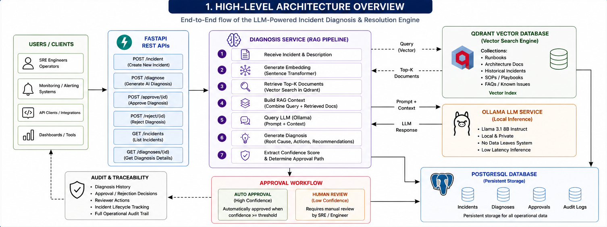
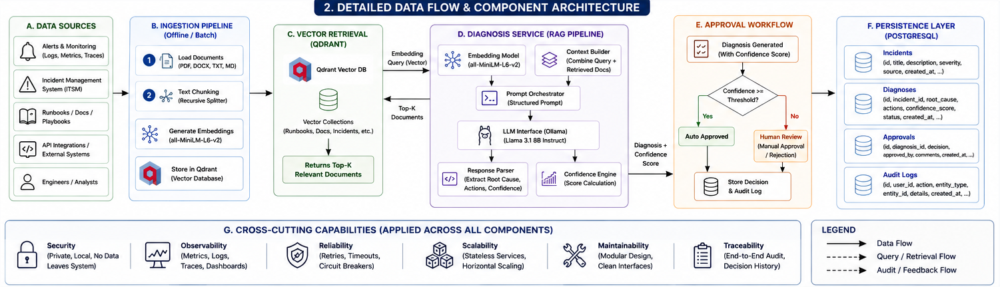

# LLM-Powered Incident Resolution Engine


## Overview

Modern production incidents are rarely solved by a single log message or alert. Engineers often spend valuable time searching through runbooks, architecture documents, operational procedures, and historical incidents before they can confidently identify a root cause and determine the correct remediation path.

As systems grow in scale and complexity, this manual investigation process becomes a major contributor to increased Mean Time To Resolution (MTTR), operational overhead, and delayed recovery during critical outages.

The LLM-Powered Incident Resolution Engine was built to address this challenge.

The platform combines Retrieval-Augmented Generation (RAG), semantic vector search, operational knowledge retrieval, confidence-based decision workflows, and human approval controls to assist engineers during incident response. Instead of generating answers in isolation, the system retrieves relevant operational knowledge, grounds its reasoning in documented procedures, evaluates confidence levels, and records every decision through a persistent audit trail.

The result is an incident response platform that not only generates diagnoses and remediation recommendations, but also emphasizes traceability, operational safety, and controllable AI-assisted decision making.

Unlike many LLM applications that function primarily as chat interfaces, this project focuses on integrating AI into a structured operational workflow. Incident creation, knowledge retrieval, diagnosis generation, approval management, audit logging, and historical traceability are treated as first-class system components rather than secondary features.

This project demonstrates how modern AI systems can be applied to production operations while maintaining the engineering controls required for real-world usage.


## Project Highlights

- AI-assisted incident diagnosis using Retrieval-Augmented Generation (RAG)
- Semantic search powered by Qdrant vector database
- Confidence-based approval workflow with human review support
- Persistent audit logging and operational traceability
- Historical diagnosis repository and incident tracking
- Local Llama 3.1 inference through Ollama
- PostgreSQL-backed persistence layer
- Interactive FastAPI Swagger documentation


## System Architecture Overview


**Figure 1. High-Level Architecture Overview**


The architecture is organized around a complete incident diagnosis and resolution workflow, beginning with knowledge ingestion and ending with approval-driven operational recommendations.

The left side of the architecture represents the platform's knowledge foundation. Operational runbooks, architecture documents, troubleshooting guides, historical incidents, and other reference material are ingested into the system and transformed into semantic embeddings. These embeddings are stored within a persistent Qdrant vector database, creating a searchable operational knowledge repository that serves as the primary source of contextual information during incident analysis.

The central component of the platform is the Diagnosis Service. Every incident submitted through the FastAPI layer is routed through this service, which orchestrates the entire diagnosis workflow. The service generates query embeddings from incident descriptions, retrieves the most relevant operational documents from Qdrant, constructs contextual evidence, and prepares structured prompts for the language model.

Retrieved operational knowledge and incident details are then passed to a locally hosted Llama 3.1 model running through Ollama. Rather than generating responses in isolation, the model produces diagnoses grounded in retrieved operational knowledge, allowing recommendations to remain closely aligned with documented procedures and historical resolution patterns.

Once a diagnosis is generated, the Confidence Engine evaluates the response and extracts a confidence score. This score is forwarded to the Approval Workflow, where recommendations are either automatically approved or routed for human review based on predefined operational thresholds.

The right side of the architecture represents the platform's persistence and governance capabilities. Incident records, diagnoses, approval decisions, and audit events are continuously stored within PostgreSQL, providing a complete historical record of how incidents were analyzed, reviewed, and resolved.

Together, these components create a closed-loop incident response platform that combines knowledge retrieval, AI-assisted diagnosis, approval management, and operational traceability into a single workflow.


## End-to-End Incident Diagnosis Workflow

The platform operates through a structured incident-response pipeline that transforms a raw incident description into a traceable, confidence-evaluated diagnosis supported by operational knowledge.

### Step 1 : Incident Registration

The workflow begins when an incident is submitted through the Incident Creation API.

Each incident is assigned a unique identifier and persisted within PostgreSQL together with its service, severity level, description, status, and creation timestamp. This creates the primary record that will be referenced throughout the diagnosis lifecycle.

At this stage, the platform has no understanding of the incident beyond the information supplied by the operator.

---

### Step 2 : Diagnosis Request

A diagnosis request is submitted through the Diagnosis API using the incident identifier and incident description.

The Diagnosis Service becomes the orchestration layer responsible for coordinating retrieval, reasoning, approval evaluation, persistence, and auditing.

Rather than sending the incident directly to the language model, the system first attempts to retrieve operational evidence from its knowledge repository.

---

### Step 3 : Semantic Retrieval from the Knowledge Base

The incident description is converted into a dense vector representation using the all-MiniLM-L6-v2 embedding model.

This embedding is used to query the Qdrant vector database containing operational runbooks, troubleshooting procedures, architecture documentation, and historical incident knowledge.

Qdrant performs similarity search against the stored vector collection and returns the most relevant documents associated with the incident.

This retrieval process allows the platform to identify operational knowledge that may be related to the observed symptoms even when exact keywords do not match.

---

### Step 4 : Context Construction

The retrieved documents are transformed into structured context.

For every retrieved document, the platform extracts:

* Document Title
* Document Type
* Operational Content

These artifacts are assembled into a contextual evidence package that accompanies the incident description.

The resulting context acts as the factual foundation used during diagnosis generation.

---

### Step 5 : Diagnosis Generation

The incident description and retrieved evidence package are merged into a structured prompt and submitted to the locally hosted Llama 3.1 model through Ollama.

The model is instructed to generate:

* Likely Root Cause
* Confidence Assessment
* Recommended Actions

Because the diagnosis is grounded in retrieved operational knowledge, recommendations remain aligned with documented procedures and previously stored organizational knowledge.

---

### Step 6 : Confidence Extraction

After a diagnosis is generated, the response is processed by the Confidence Service.

The service extracts and normalizes the confidence value produced by the language model.

This confidence score becomes the primary control mechanism used to determine whether a recommendation can proceed automatically or requires human review.

---

### Step 7 : Approval Evaluation

The Approval Service compares the extracted confidence score against the configured approval threshold.

High-confidence diagnoses are marked as:

AUTO_APPROVED

Lower-confidence diagnoses are marked as:

HUMAN_REVIEW_REQUIRED

This approval gate prevents unrestricted AI-generated recommendations from entering operational workflows without oversight.

---

### Step 8 : Persistence and Audit Logging

Once approval evaluation is complete, the platform persists the outcome within PostgreSQL.

The workflow stores:

* Incident Information
* Generated Diagnosis
* Confidence Score
* Approval Status
* Reviewer Actions
* Audit Events

Every decision made by the platform becomes part of a permanent operational record.

---

### Step 9 : Historical Traceability

The stored records become accessible through the Incident History and Diagnosis History APIs.

Engineers can review previous incidents, analyze generated diagnoses, inspect approval decisions, and reconstruct the complete sequence of events associated with any incident investigation.

This transforms the platform from a simple diagnosis engine into a traceable incident-management system capable of supporting operational audits and historical analysis.


## Detailed Technical Architecture

While the System Architecture Overview presents the platform at a component level, the detailed architecture focuses on the internal implementation paths responsible for knowledge ingestion, semantic retrieval, diagnosis generation, approval management, and operational persistence.

The platform is built around two continuously connected execution paths: the Knowledge Processing Path and the Incident Diagnosis Path.


**Figure 2. Detailed Data Flow and Component Architecture**


### Knowledge Processing Path

The platform begins by transforming operational knowledge into a machine-searchable repository.

Knowledge sources such as runbooks, architecture documentation, troubleshooting guides, and historical incident records are ingested through the data ingestion pipeline. These documents are parsed, normalized, and prepared for semantic indexing.

Each document is converted into a dense vector representation using the all-MiniLM-L6-v2 Sentence Transformer model. Unlike traditional keyword indexing, semantic embeddings capture contextual meaning, allowing the platform to retrieve relevant operational knowledge even when incident descriptions do not contain exact keyword matches.

Generated embeddings are stored within a persistent Qdrant vector database. Each stored vector is associated with document metadata including title, document type, and content. This creates a searchable operational knowledge repository that serves as the foundation for Retrieval-Augmented Generation (RAG).

Once indexed, the knowledge base remains available for incident diagnosis requests without requiring document reprocessing.


### Incident Diagnosis Path

When a diagnosis request is received, the Diagnosis Service becomes the primary orchestration component of the platform.

The submitted incident description is converted into an embedding using the same embedding model used during knowledge ingestion. This ensures that incident vectors and knowledge vectors exist within the same semantic space.

The generated query embedding is submitted to Qdrant, where similarity search is performed against the indexed knowledge collection. The retrieval engine identifies the most relevant operational documents and returns the highest-ranked matches.

For each retrieved document, the platform extracts:

* Document Title
* Document Type
* Document Content

These results are assembled into a structured contextual evidence package.

The evidence package is combined with the incident description and transformed into a diagnosis prompt containing both observed symptoms and supporting operational knowledge.


### LLM Reasoning Layer

The completed prompt is submitted to a locally hosted Llama 3.1 model running through Ollama.

The model is instructed to generate:

* Likely Root Cause
* Confidence Assessment
* Recommended Actions

Because retrieved operational knowledge is embedded directly into the prompt, the generated diagnosis remains grounded in organizational documentation rather than relying solely on the language model's pretrained knowledge.

This Retrieval-Augmented Generation approach enables the platform to produce recommendations that remain aligned with stored runbooks, troubleshooting procedures, and historical operational practices.


### Confidence Evaluation and Approval Processing

After diagnosis generation, the response is passed to the Confidence Service.

The service extracts confidence information from the generated diagnosis and converts it into a normalized confidence score.

The Approval Service evaluates this score against the configured approval threshold defined within the platform configuration.

Based on the evaluation result, diagnoses are categorized as:

* AUTO_APPROVED
* HUMAN_REVIEW_REQUIRED

Approval decisions are recorded independently from diagnosis generation, allowing operational governance to remain separate from AI reasoning.

This separation enables organizations to introduce human review requirements without modifying the diagnosis pipeline itself.


### Persistence and Auditability

All operational activities are persisted within PostgreSQL.

The platform maintains dedicated records for:

* Incidents
* Diagnoses
* Approvals
* Audit Events
* Knowledge Documents

Every diagnosis generated by the platform produces an associated audit trail that captures the resulting decision state and operational outcome.

Approval actions performed through the approval APIs are also recorded, enabling complete historical reconstruction of incident investigations.

This persistence model ensures that diagnoses, recommendations, approval decisions, and reviewer actions remain traceable long after incident resolution.


### Architectural Outcome

The resulting architecture combines semantic retrieval, Retrieval-Augmented Generation, confidence-based governance, approval workflows, and persistent auditability into a single operational platform.

Rather than functioning as a standalone language-model interface, the system acts as a structured incident-management workflow capable of transforming operational knowledge into traceable, reviewable, and context-aware incident diagnoses.


## Key Features

### AI-Powered Incident Diagnosis

Generates root-cause analysis and remediation recommendations for production incidents using Retrieval-Augmented Generation (RAG) and a locally hosted Llama 3.1 model.


### Retrieval-Augmented Generation (RAG)

Enhances diagnosis quality by retrieving operational knowledge from runbooks, architecture documents, troubleshooting guides, and historical incidents before generating recommendations.


### Semantic Search with Qdrant

Uses vector embeddings and similarity search to identify operational knowledge relevant to an incident, even when exact keywords are not present in the incident description.


### Persistent Operational Knowledge Base

Maintains a searchable repository of organizational knowledge including runbooks, architecture documentation, and historical incident records.


### Confidence-Based Decision Engine

Automatically extracts confidence scores from generated diagnoses and evaluates recommendations against configurable operational thresholds.


### Human-in-the-Loop Approval Workflow

Supports both automated approvals and manual review workflows to ensure operational oversight for lower-confidence recommendations.


### Incident Management APIs

Provides dedicated APIs for incident creation, diagnosis generation, diagnosis retrieval, incident history, approval processing, and rejection workflows.


### Audit Logging and Traceability

Records diagnoses, approval decisions, reviewer actions, and operational events to create a complete audit trail across the incident lifecycle.


### Historical Diagnosis Repository

Maintains historical diagnosis records that can be reviewed, audited, and analyzed for future investigations.


### PostgreSQL Persistence Layer

Persists incidents, diagnoses, approvals, audit events, and knowledge documents to ensure durability and long-term traceability.


### Interactive API Documentation

Includes Swagger/OpenAPI documentation for testing and interacting with platform endpoints through a browser interface.


### Local LLM Deployment

Runs entirely on locally hosted models through Ollama, eliminating dependency on external LLM APIs and allowing offline operation.


## Technology Stack

| Layer                  | Technology                | Purpose                                                                                     |
| ---------------------- | ------------------------- | ------------------------------------------------------------------------------------------- |
| Backend Framework      | FastAPI                   | REST API development and request handling                                                   |
| Database               | PostgreSQL                | Persistent storage for incidents, diagnoses, approvals, audit logs, and knowledge documents |
| Vector Database        | Qdrant                    | Semantic search and retrieval of operational knowledge                                      |
| Embedding Model        | all-MiniLM-L6-v2          | Generation of document and incident embeddings                                              |
| Large Language Model   | Llama 3.1 (8B) via Ollama | Root-cause analysis and recommendation generation                                           |
| ORM                    | SQLAlchemy                | Database interaction and persistence                                                        |
| Validation             | Pydantic                  | Request and response validation                                                             |
| API Documentation      | Swagger / OpenAPI         | Interactive API testing and documentation                                                   |
| Environment Management | python-dotenv             | Secure configuration management                                                             |
| Programming Language   | Python 3.13               | Core application development                                                                |

### Core Architectural Components

* FastAPI REST APIs
* Retrieval-Augmented Generation (RAG)
* Semantic Vector Search
* Confidence Evaluation Engine
* Human Approval Workflow
* Audit Logging Framework
* Persistent Knowledge Repository
* Historical Diagnosis Management


## API Endpoints

The platform exposes a set of REST APIs that support incident creation, AI-assisted diagnosis, approval management, historical retrieval, and operational traceability.

### Incident Management

| Method | Endpoint     | Description                       |
| ------ | ------------ | --------------------------------- |
| POST   | `/incident`  | Create a new incident record      |
| GET    | `/incidents` | Retrieve all registered incidents |

#### Create Incident

```json
{
  "incident_id": "INC-9001",
  "service": "payment-api",
  "severity": "HIGH",
  "description": "Payment API returning 503 errors during peak traffic."
}
```

**Sample Response**

```json
{
  "incident_db_id": 39
}
```

---

### AI Diagnosis

| Method | Endpoint          | Description                                    |
| ------ | ----------------- | ---------------------------------------------- |
| POST   | `/diagnose`       | Generate AI-assisted diagnosis for an incident |
| GET    | `/diagnoses`      | Retrieve diagnosis history                     |
| GET    | `/diagnosis/{id}` | Retrieve a specific diagnosis                  |

#### Generate Diagnosis

```json
{
  "incident_db_id": 39,
  "description": "Authentication service returning 401 and 503 errors. Database timeout observed. Login requests experiencing high latency."
}
```

The diagnosis workflow automatically performs:

1. Semantic retrieval from Qdrant
2. Context construction
3. LLM reasoning through Ollama
4. Confidence extraction
5. Approval evaluation
6. Persistence and audit logging

**Sample Response**

```json
{
  "diagnosis": {
    "approval_status": "AUTO_APPROVED",
    "confidence_score": 0.9,
    "diagnosis": "..."
  }
}
```

---

### Approval Management

| Method | Endpoint                 | Description         |
| ------ | ------------------------ | ------------------- |
| POST   | `/approve/{approval_id}` | Approve a diagnosis |
| POST   | `/reject/{approval_id}`  | Reject a diagnosis  |

#### Approve Diagnosis

```http
POST /approve/6
```

**Response**

```json
{
  "message": "Approved"
}
```

#### Reject Diagnosis

```http
POST /reject/6
```

**Response**

```json
{
  "message": "Rejected"
}
```

---

### Historical Retrieval

The platform maintains complete historical records for operational analysis and auditing.

| Endpoint                | Purpose                                 |
| ----------------------- | --------------------------------------- |
| `/incidents`            | Incident history                        |
| `/diagnoses`            | Diagnosis history                       |
| `/diagnosis/{id}`       | Detailed diagnosis retrieval            |
| PostgreSQL Audit Tables | Operational traceability and governance |

---

### Interactive API Documentation

Swagger/OpenAPI documentation is automatically generated by FastAPI and provides an interactive interface for testing platform endpoints.

```text
http://localhost:8000/docs
```


## Project Structure

```text
The-LLM-Incident-Resolution-Engine
│
├── backend
│   ├── app
│   │   ├── api
│   │   ├── audit
│   │   ├── confidence
│   │   ├── database
│   │   ├── ingestion
│   │   ├── llm
│   │   ├── models
│   │   ├── retrieval
│   │   └── services
│   │
│   ├── qdrant_storage
│   └── main.py
│
├── docs
├── frontend
├── sample-data
└── README.md
```

### Backend

The backend contains the complete application logic, API layer, retrieval pipeline, diagnosis engine, approval workflows, and persistence components.

---

### API Layer (`app/api`)

Responsible for exposing REST endpoints used throughout the platform.

**Modules**

* `incident_api.py`
* `diagnosis_api.py`
* `approval_api.py`
* `history_api.py`

Provides:

* Incident creation
* Diagnosis generation
* Approval actions
* Historical retrieval APIs

---

### Audit Layer (`app/audit`)

Responsible for operational traceability.

**Module**

* `audit_service.py`

Handles:

* Diagnosis audit events
* Approval activity logging
* Incident lifecycle tracking

---

### Confidence Engine (`app/confidence`)

Responsible for confidence extraction and normalization.

**Module**

* `confidence_service.py`

Handles:

* Confidence score extraction
* Confidence normalization
* Approval workflow integration

---

### Database Layer (`app/database`)

Responsible for database connectivity and session management.

**Module**

* `database.py`

Handles:

* PostgreSQL connection management
* SQLAlchemy session creation
* ORM initialization

---

### Knowledge Ingestion (`app/ingestion`)

Responsible for loading operational knowledge into the platform.

**Module**

* `load_data.py`

Processes:

* Runbooks
* Architecture documentation
* Historical incident data
* Operational reference material

---

### LLM Layer (`app/llm`)

Responsible for diagnosis generation.

**Modules**

* `llm_provider.py`
* `diagnose.py`

Handles:

* Ollama integration
* Prompt execution
* Llama 3.1 inference

---

### Data Models (`app/models`)

Contains SQLAlchemy database models used throughout the platform.

**Module**

* `models.py`

Defines:

* Incidents
* Diagnoses
* Approvals
* Audit Events
* Knowledge Documents

---

### Retrieval Layer (`app/retrieval`)

Responsible for semantic search and vector operations.

**Modules**

* `build_embeddings.py`
* `embed_documents.py`
* `qdrant_store.py`
* `search.py`

Handles:

* Embedding generation
* Vector indexing
* Similarity search
* Qdrant interaction

---

### Service Layer (`app/services`)

Core orchestration layer of the platform.

**Modules**

* `diagnosis_service.py`
* `approval_service.py`
* `diagnosis_repository.py`
* `incident_repository.py`

Handles:

* Diagnosis orchestration
* Approval evaluation
* Persistence operations
* Business workflow execution

---

### Qdrant Storage

Persistent vector database storage used by the retrieval pipeline.

Stores:

* Knowledge embeddings
* Vector collections
* Semantic search indexes

---

### Sample Data

Contains structured operational knowledge used during ingestion.

Files include:

* `runbooks.json`
* `architecture_docs.json`
* `incidents.json`

These datasets are transformed into embeddings and indexed within Qdrant to support Retrieval-Augmented Generation.

```
```


## Setup & Installation

### Prerequisites

Ensure the following software is installed before running the platform:

| Software   | Version |
| ---------- | ------- |
| Python     | 3.11+   |
| PostgreSQL | 14+     |
| Ollama     | Latest  |
| Git        | Latest  |

---

### Clone Repository

```bash
git clone https://github.com/<username>/LLM-Incident-Resolution-Engine.git

cd LLM-Incident-Resolution-Engine
```

---

### Create Virtual Environment

```bash
python -m venv venv
```

#### Windows

```bash
venv\Scripts\activate
```

#### Linux / macOS

```bash
source venv/bin/activate
```

---

### Install Dependencies

Navigate to the backend directory:

```bash
cd backend
```

Install required packages:

```bash
pip install -r app/requirements.txt
```

---

### Configure Environment Variables

Create a `.env` file inside:

```text
backend/
```

Example configuration:

DATABASE_URL=<your_postgresql_connection_string>

OLLAMA_URL=http://localhost:11434/api/generate

AUTO_APPROVAL_THRESHOLD=0.8

---

### Start PostgreSQL

Create a database:

```sql
CREATE DATABASE incident_diagnosis_db;
```

Ensure PostgreSQL is running before starting the application.

---

### Start Ollama

Pull the model:

```bash
ollama pull llama3.1:8b
```

Run Ollama:

```bash
ollama serve
```

Verify:

```bash
ollama list
```

---

### Load Knowledge Base

The platform ships with sample operational data located in:

```text
sample-data/
```

Load the knowledge documents:

```bash
python -m app.ingestion.load_data
```

---

### Build Vector Store

Generate embeddings and populate Qdrant:

```bash
python -m app.retrieval.qdrant_store
```

Expected output:

```text
Inserted XX vectors into Qdrant
```

---

### Start the Application

From the backend directory:

```bash
python -m uvicorn main:app --reload
```

Expected output:

```text
Uvicorn running on http://127.0.0.1:8000
```

---

### Access Swagger UI

Open:

```text
http://127.0.0.1:8000/docs
```

Swagger provides an interactive interface for testing all platform APIs.

---

### Verify Installation

Create an incident:

```http
POST /incident
```

Generate a diagnosis:

```http
POST /diagnose
```

Verify records are created in:

* Incidents
* Diagnoses
* Approvals
* Audit Logs

within PostgreSQL.

A successful diagnosis confirms:

* FastAPI is running
* PostgreSQL connectivity is working
* Ollama is responding
* Qdrant retrieval is functioning
* Approval workflow is operational
* Audit logging is enabled

```
```


## Sample Diagnosis Response

The example below demonstrates a diagnosis generated by the platform for an authentication-service incident.

### Incident Input

```json
{
  "incident_db_id": 39,
  "description": "Authentication service returning 401 and 503 errors. Database timeout observed. Login requests experiencing high latency."
}


{
  "diagnosis": {
    "approval_status": "AUTO_APPROVED",
    "confidence_score": 0.9,
    "diagnosis": "**Likely Root Cause:** Certificate issues or configuration problems with the authentication service are causing it to return 401 and 503 errors, leading to database timeouts due to failed login requests.

**Confidence Score:** 0.9

**Recommended Actions:**

1. Rotate expired certificates.
2. Verify certificate validity and configuration.
3. Inspect token-signing configuration.
4. Restart authentication services.
5. Review database connection health and timeout metrics."
  }
}


## Future Enhancements

The current implementation establishes a complete AI-assisted incident diagnosis workflow. Future iterations of the platform can extend its capabilities in several directions:

### Real-Time Incident Ingestion

Integrate monitoring and observability platforms such as Prometheus, Grafana, Datadog, Splunk, or ELK to automatically create incidents from alerts and operational events.

---

### Automated Runbook Execution

Extend recommendations into executable remediation workflows capable of triggering predefined operational actions after approval.

Examples include:

- Service restarts
- Cache invalidation
- Certificate rotation
- Infrastructure scaling
- Database failover procedures

---

### Advanced Approval Policies

Introduce role-based approval workflows with multiple review stages for high-severity incidents.

Examples:

- Team Lead Approval
- SRE Approval
- Security Approval
- Change Management Approval

---

### Enhanced Knowledge Sources

Expand the retrieval layer to ingest additional operational knowledge including:

- Internal Wikis
- Confluence Documentation
- Incident Postmortems
- System Design Documents
- Operational Playbooks

---

### Improved Confidence Evaluation

Replace rule-based confidence extraction with dedicated confidence-scoring models capable of evaluating diagnosis quality and retrieval relevance.

---

### Incident Analytics Dashboard

Develop a web-based dashboard for:

- Incident Trends
- Root Cause Distribution
- Approval Statistics
- Resolution Metrics
- Historical Diagnosis Analysis

---

### Containerized Deployment

Package the platform using Docker and Docker Compose to simplify deployment and onboarding across environments.

---

### Cloud-Native Deployment

Support deployment on public cloud platforms using managed databases, scalable vector stores, and container orchestration platforms.


## Engineering Concepts Demonstrated

This project demonstrates the application of modern AI, backend engineering, data management, and operational governance concepts within a production-style incident response platform.

### Artificial Intelligence & Machine Learning

- Retrieval-Augmented Generation (RAG)
- Semantic Search
- Vector Embeddings
- Large Language Model Integration
- Context-Aware Prompt Engineering
- Confidence Evaluation

---

### Backend Engineering

- REST API Design
- Service-Oriented Architecture
- Repository Pattern
- Business Logic Separation
- Request Validation
- Configuration Management

---

### Data Engineering

- Knowledge Ingestion Pipelines
- Document Processing
- Embedding Generation
- Vector Indexing
- Structured Data Persistence

---

### Database Engineering

- Relational Database Design
- SQLAlchemy ORM
- Transaction Management
- Historical Data Retention
- Audit Trail Persistence

---

### Information Retrieval

- Similarity Search
- Vector Databases
- Top-K Retrieval
- Context Construction
- Knowledge Ranking

---

### Operational Governance

- Human-in-the-Loop Systems
- Approval Workflows
- Confidence-Based Decision Gates
- Audit Logging
- Historical Traceability

---

### Software Architecture

- Layered Architecture
- Separation of Concerns
- Modular Design
- Workflow Orchestration
- Persistent Storage Architecture

---

### Reliability Engineering Concepts

- Incident Management
- Root Cause Analysis
- Operational Runbooks
- Knowledge-Centric Troubleshooting
- Incident History Management
- Decision Traceability
